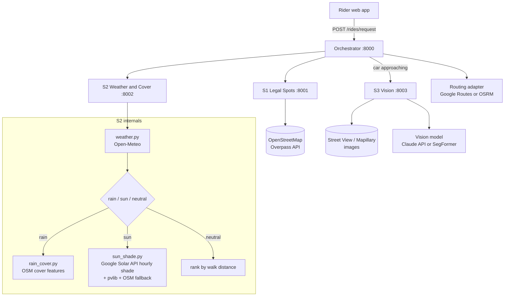
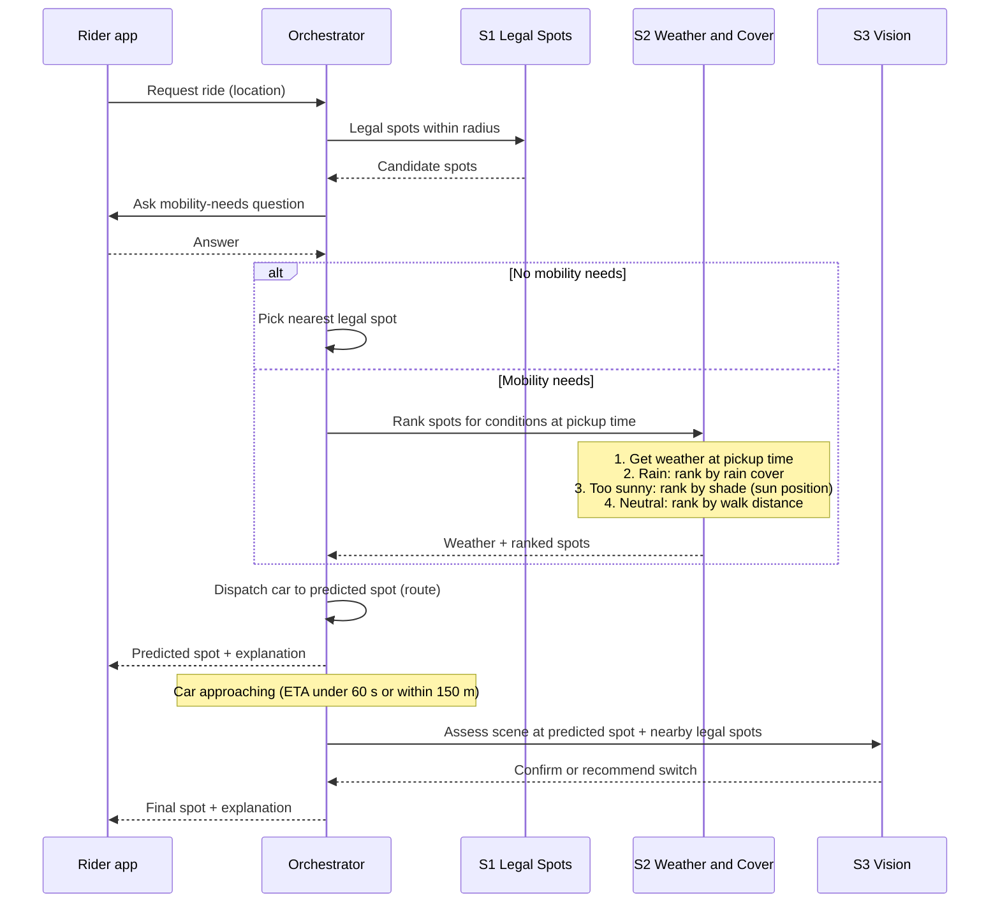

git # Endpoint: Implementation Guide

> **Waymo nailed the ride. Endpoint handles the last 50 meters.**
>
> Endpoint picks robotaxi pickup and dropoff spots that keep riders with mobility needs out of the rain and sun. It **predicts** the best spot from public data before the car leaves, then **confirms** it with real-time computer vision as the car arrives.

This document is the build plan for tonight. Every service has a clear contract, owner, data source, fallback, and definition of done. If you only read one section, read **§3 (Flow)** and **§9 (Timeline)**.

---

## Table of contents

1. [Scope and demo assumptions](#1-scope-and-demo-assumptions)
2. [Architecture](#2-architecture)
3. [End-to-end flow](#3-end-to-end-flow)
4. [Design decisions (read before coding)](#4-design-decisions-read-before-coding)
5. [Shared data models](#5-shared-data-models)
6. [Services](#6-services)
7. [Orchestrator logic](#7-orchestrator-logic)
8. [Repo layout, ports, and setup](#8-repo-layout-ports-and-setup)
9. [Team split and timeline](#9-team-split-and-timeline)
10. [Demo script](#10-demo-script)
11. [Risks and gotchas](#11-risks-and-gotchas)
12. [Stretch goals](#12-stretch-goals)

---

## 1. Scope and demo assumptions

**What we are building:** a working backend of 5 microservices plus an orchestrator, and a simple map-based web UI that shows the rider, candidate spots, the predicted pickup spot, the car's route, and the final vision-confirmed spot.

**What we are simulating:**

- **The car.** There is no real vehicle. The orchestrator simulates a car driving a route and "arriving." Say this plainly in the pitch.
- **The car's camera.** S3 (Vision) runs on Street View / Mapillary images of the candidate spots (or a pre-recorded video) as a stand-in for the car's live camera feed.
- **The weather.** It probably won't rain on cue during judging. Every service accepts a **demo override** (e.g. `force_condition=rain`) so we can show both scenarios on demand.

**Demo area:** pick **one neighborhood** (roughly 500 m × 500 m) with good OSM coverage (awnings, trees, building heights, bus stops) and Street View imagery. Hardcode its bounding box and **cache all API responses** for it before the demo.

---

## 2. Architecture

Two phases, four processes:

- **Predictive phase** (before the car leaves): S1 finds legal spots, then S2 checks the weather and ranks those spots by rain cover or sun shade, all in one call.
- **Real-time phase** (as the car arrives): S3 uses computer vision to confirm or correct the prediction.



| Service | Name | Phase | Question it answers |
|---|---|---|---|
| Orchestrator | Ride planner | Both | What happens next, and in what order? |
| S1 | Legal Spots | Predictive | Where can the car legally stop near the rider? |
| S2 | Weather and Cover | Predictive | What are conditions at pickup time, and which legal spot best protects the rider from them (rain cover if raining, shade if too sunny)? |
| S3 | Vision | Real-time | Looking at the actual scene, is the chosen spot really covered or shaded, and is there a better one nearby? |

**Why S2 is one service:** weather, rain cover, and sun shade are one decision ("protect the rider from current conditions"), so they sit behind one API route. Inside, S2 is split into three modules (`weather.py`, `rain_cover.py`, `sun_shade.py`) so two people can build it in parallel without merge conflicts.

**Tech stack (recommended):** Python 3.11, FastAPI + Uvicorn for every service, `httpx` for service-to-service calls, `shapely` + `pyproj` for geometry, `pvlib` for sun position, `rasterio` + `numpy` for the Solar API shade rasters, Leaflet (or Google Maps JS) for the UI. Every service is its own FastAPI app on its own port. Docker Compose is optional; if Docker slows anyone down, just run each service with `uvicorn` in its own terminal.

---

## 3. End-to-end flow

This is the order of operations, top to bottom.



**Step by step:**

1. **Ride request.** The rider app sends their location to the orchestrator.
2. **S1: Legal spots.** The orchestrator asks S1 for every legal stopping spot within a radius (default 150 m).
3. **Mobility-needs question.** The app asks the rider one question (see §4.1 for wording).
4. **No mobility needs:** pick the nearest legal spot, dispatch, done (skip to step 7).
5. **S2: Weather and Cover (one call).** The orchestrator sends S2 the rider location, the legal spots, and the predicted pickup time (now + car ETA). Inside S2:
   - It gets the weather **at pickup time** and classifies it as `rain`, `sun` (too sunny), or `neutral`.
   - **Rain:** ranks spots by nearby rain cover (awnings, canopies, covered walkways, shelters).
   - **Too sunny:** ranks spots by shade at pickup time, using the sun's position, Google Solar API hourly shade maps, and awnings/trees/buildings.
   - **Neutral** (overcast, night, mild): ranks spots by walk distance.
   - Returns the weather report and the ranked spots in one response.
6. **Dispatch.** The orchestrator routes the car to the top-ranked spot and tells the rider where to go and why.
7. **Approach.** When the simulated car is within ~150 m or ~60 s away, the orchestrator switches to real-time mode (skipped in `neutral` mode).
8. **S3: Vision.** S3 looks at images of the predicted spot and nearby legal alternatives, and confirms or recommends a switch.
9. **Final spot.** The orchestrator fuses the predictive score with the vision score, picks the final spot, and updates the rider with a one-line explanation.

---

## 4. Design decisions (read before coding)

### 4.1 Ask about needs, not identity

The flow asks whether the rider needs help, but **do not word it as "Are you disabled?"** Many older riders and cane users won't identify as disabled and will answer "no." Use:

> **"Would you like a pickup spot that's easier to reach and keeps you out of the rain and sun?"**
> [Yes, prioritize comfort and steady footing] [No, fastest pickup]

The logic is unchanged: **Yes** = mobility needs branch, **No** = nearest legal spot. Store the answer as a rider preference so we don't ask every ride.

### 4.2 Vision can never pick an illegal spot

S3 (Vision) only chooses **among S1's legal spots**. It can confirm the predicted spot or switch to another legal spot nearby, but it never invents a new stopping point. This is a safety rule and a good line for judges.

### 4.3 Stop point vs. wait point

Each candidate has two locations:

- **Stop point:** where the car stops at the curb (from S1).
- **Wait point:** where the rider stands while waiting (the covered/shaded area near the stop point, from S2).

For **rain**, the wait point must be covered **and** close to the car door (default max gap: **5 m**), because the rider also has to walk from the cover to the car. For **sun**, the wait point needs shade (default max gap: **15 m**), since the rider can wait in shade and walk out when the car arrives.

### 4.4 Predict at pickup time, not request time

Weather and sun position must be computed for **`pickup_time = now + car_ETA`**. A spot shaded at 4:00 pm may be in full sun at 4:15 pm.

### 4.5 Every service has a fallback

No service failure should break a ride. If anything fails or returns nothing, fall back to the **nearest legal spot** and log why. The orchestrator enforces timeouts of **3 s** for S1, **6 s** for S2 (it does more work, but serves from cache), and **8 s** for S3 (Vision).

### 4.6 Every recommendation carries a confidence level

| Tier | Meaning | Example source |
|---|---|---|
| `verified` | Official or explicitly tagged data | OSM `covered=yes`, city shelter dataset |
| `likely` | Inferred from a strong heuristic | Hotel entrance, tree canopy geometry |
| `detected` | Seen by the vision model | S3 sees an awning in the image |
| `unverified` | No data either way | Nothing tagged nearby |

Show the tier in the UI. It builds trust and it's honest about data gaps.

### 4.7 Every decision produces an explanation

Each ranking step returns a short `reason` string. The final rider message is built from them, e.g.:

> *"Rain expected in 6 min. Moved your pickup 40 m to the covered hotel entrance on Main St. (verified cover, confirmed by camera)."*

---

## 5. Shared data models

Put these Pydantic models in `shared/models.py`; every service imports them so contracts can't drift. JSON shown below.

### `LatLng`
```json
{ "lat": 25.7617, "lng": -80.1918 }
```

### `Spot` (from S1)
```json
{
  "spot_id": "s1_0042",
  "stop_point": { "lat": 25.76171, "lng": -80.19183 },
  "street_name": "SE 2nd Ave",
  "side": "east",
  "curb_bearing_deg": 90.0,
  "spot_type": "curb",
  "walk_distance_m": 48.2,
  "source": "osm",
  "confidence": "likely",
  "notes": []
}
```
- `spot_type`: `curb` | `loading_zone` | `parking_lot` | `driveway_pullout`
- `curb_bearing_deg`: compass direction from the stop point toward the sidewalk (used by S3 to aim the camera).

### `WeatherReport` (from S2; see the updated version in §6 S2 Module 1)
```json
{
  "condition": "rain",
  "precip_mm_h": 2.4,
  "cloud_cover_pct": 95,
  "temperature_c": 27.1,
  "is_day": true,
  "weather_code": 63,
  "valid_at": "2026-09-26T21:15:00Z",
  "source": "open-meteo",
  "overridden": false
}
```
- `condition`: `rain` | `sun` | `neutral`

### `CoverFeature` (from S2)
```json
{
  "feature_id": "osm_way_123456",
  "kind": "awning",
  "geometry_wkt": "POLYGON((...))",
  "provides": ["rain", "sun"],
  "source": "osm",
  "confidence": "verified"
}
```
- `kind`: `awning` | `canopy` | `covered_walkway` | `shelter` | `building_passage` | `tree` | `building_shadow`
- `provides`: which conditions it protects against. Trees provide `sun` only.

### `RankedSpot` (from S2 / orchestrator)
```json
{
  "spot": { "...": "Spot object" },
  "wait_point": { "lat": 25.76175, "lng": -80.19180 },
  "cover_feature": { "...": "CoverFeature or null" },
  "gap_m": 3.1,
  "score": 0.86,
  "confidence": "verified",
  "reason": "Covered hotel canopy 3 m from the car door"
}
```

### `VisionAssessment` (from S3)
```json
{
  "spot_id": "s1_0042",
  "mode": "rain",
  "cover_present": true,
  "cover_kind": "awning",
  "shade_fraction": null,
  "vision_score": 0.9,
  "model_confidence": 0.82,
  "image_ref": "cache/streetview/s1_0042_h90.jpg",
  "reason": "Awning visible over the sidewalk directly beside the curb"
}
```

### `RidePlan` (from orchestrator)
```json
{
  "ride_id": "r_20260926_001",
  "phase": "predicted",
  "mobility_needs": true,
  "weather": { "...": "WeatherReport" },
  "candidates": [ { "...": "RankedSpot" } ],
  "predicted_spot": { "...": "RankedSpot" },
  "final_spot": null,
  "route_polyline": "encoded_polyline_here",
  "eta_s": 240,
  "rider_message": "Rain expected in 6 min. Wait under the hotel canopy on SE 2nd Ave.",
  "fallbacks_used": []
}
```
- `phase`: `predicted` → `approaching` → `confirmed`

---
## 6. Services

Every service follows the same conventions:

- FastAPI app with `GET /health` returning `{"status": "ok"}`.
- **Mock mode:** if env var `MOCK=1`, return fixture JSON from `fixtures/` instead of calling real APIs. Build this first so the orchestrator can integrate in hour 1.
- **Demo overrides** are accepted as optional request fields and always echoed back in the response (`"overridden": true`).
- All times are **UTC ISO-8601** internally. Convert to local time only in the UI.
- All geometry math happens in **meters** (projected UTM), never in raw lat/lng degrees. Use the helper below.

### Shared geometry helper (`shared/geo.py`)

```python
from pyproj import Transformer

def local_projector(lat: float, lng: float):
    """Return (to_meters, to_latlng) transformers for the UTM zone at this point.
    NOTE: always_xy=True means coordinate order is (lng, lat) / (x, y)."""
    zone = int((lng + 180) // 6) + 1
    epsg = (32600 if lat >= 0 else 32700) + zone
    to_m = Transformer.from_crs("EPSG:4326", f"EPSG:{epsg}", always_xy=True)
    to_ll = Transformer.from_crs(f"EPSG:{epsg}", "EPSG:4326", always_xy=True)
    return to_m, to_ll
```

> ⚠️ **The #1 bug tonight will be lat/lng order.** Our JSON uses `{lat, lng}`. GeoJSON, shapely-with-pyproj (`always_xy`), and OSRM use `(lng, lat)`. Convert at the boundary and nowhere else.

---

### S1: Legal Spots Service (port 8001)

**Owner:** Person B
**Job:** Return every place the car can legally stop within a radius of the rider.

**API route:** `POST /spots/legal`

Request:
```json
{ "rider_location": { "lat": 25.7617, "lng": -80.1918 }, "radius_m": 150 }
```
Response:
```json
{ "spots": [ { "...": "Spot" } ], "count": 27, "source": "osm", "cached": true }
```

**Data source:** OpenStreetMap via the Overpass API (`https://overpass-api.de/api/interpreter`). Optional: your city's curb regulation / loading zone open data, if it exists.

**Overpass query:**
```
[out:json][timeout:25];
(
  way["highway"~"^(primary|secondary|tertiary|residential|unclassified|living_street)$"](around:{R},{LAT},{LNG});
  node["emergency"="fire_hydrant"](around:{R},{LAT},{LNG});
  node["highway"~"^(crossing|bus_stop|traffic_signals|stop)$"](around:{R},{LAT},{LNG});
  way["amenity"="parking"](around:{R},{LAT},{LNG});
);
out body geom;
```

**Algorithm:**

1. **Generate curb candidates.** For each road way, offset the centerline to each side by half the road width (use the `width` tag if present, else 4 m per side) to approximate the curb line. Sample a candidate stop point every **10 m** along each curb line. Record `curb_bearing_deg` (perpendicular to the road, pointing at the sidewalk).
2. **Remove illegal candidates** using configurable buffers. Defaults below are modeled on common US parking rules; **verify them for your demo city**:

   | Feature | OSM tag | Exclusion buffer |
   |---|---|---|
   | Fire hydrant | `emergency=fire_hydrant` | 4.6 m (15 ft) |
   | Crosswalk | `highway=crossing` | 6 m (20 ft) |
   | Intersection | node shared by 2+ road ways | 6 m (20 ft) |
   | Stop sign / signal | `highway=stop` / `traffic_signals` | 9 m (30 ft) |
   | Bus stop | `highway=bus_stop` | 15 m |
   | Bike lane | `cycleway=lane`, `cycleway:right=lane`, `cycleway:left=lane`, `cycleway:both=lane` | exclude that side of the road |
   | No-stopping curb | `parking:<side>=no`, or `parking:<side>:restriction=no_stopping` | exclude that side |

3. **Tag confidence.** If the road side has an explicit parking tag (`parking:<side>=lane` / `street_side`, or legacy `parking:lane:<side>=parallel` etc.), mark `confidence: "likely"`. Otherwise `"unverified"`.
4. **Add parking lots** (`amenity=parking`) as `spot_type: "parking_lot"` candidates at the lot's nearest point to the rider.
5. **Compute `walk_distance_m`** as straight-line distance × 1.3 (detour factor). Stretch: replace with Google Routes walking distance.
6. **Deduplicate** candidates within 5 m of each other and return the nearest **30**.

**Fallback:** if Overpass fails, return the cached result for the demo bounding box. If there's no cache, return a single spot at the nearest road point with `confidence: "unverified"`.

**Known simplification (say this if asked):** a robotaxi *stopping* briefly to load a passenger follows different rules than *parking*. We use parking rules as a conservative stand-in.

**Definition of done:** for 3 test locations in the demo area, the UI shows spots on both sides of the street, none within the hydrant, crosswalk, bus stop, or bike-lane exclusions.

---

### S2: Weather and Cover Service (port 8002)

**Owners:** Person B (`weather.py`, `rain_cover.py`) and Person C (`sun_shade.py`)
**Job:** In one call, determine conditions at pickup time, then rank the legal spots by how well they protect the rider from those conditions: rain cover if it's raining, shade if it's too sunny, walk distance otherwise.

#### API routes

| Method | Path | Purpose |
|---|---|---|
| `POST` | `/conditions/rank` | **Main route.** Weather + ranking in one call |
| `GET` | `/conditions/weather?lat=..&lng=..&at=..&force_condition=..` | Weather only (debugging, UI badge) |
| `GET` | `/conditions/features?lat=..&lng=..&radius_m=..` | Raw `CoverFeature` list (for drawing cover on the map) |

Request (`/conditions/rank`):
```json
{
  "rider_location": { "lat": 25.7617, "lng": -80.1918 },
  "spots": [ { "...": "Spot" } ],
  "pickup_time": "2026-09-26T19:30:00Z",
  "wait_minutes": 10,
  "force_condition": null,
  "force_time": null
}
```
Response (`ConditionsResult`, add to `shared/models.py`):
```json
{
  "weather": { "...": "WeatherReport" },
  "mode": "rain",
  "ranked": [ { "...": "RankedSpot" } ],
  "needs_rider_confirmation": false,
  "nearest_spot_id": "s1_0007",
  "sun": { "elevation_deg": 41.2, "azimuth_deg": 238.5 },
  "shade_source": null,
  "overlays": { "cover_features": [ { "...": "CoverFeature" } ], "shade_geojson": null },
  "fallbacks_used": []
}
```
- `mode`: `rain` | `sun` | `neutral`
- `shade_source`: `google_solar` | `osm_geometry` | `null`
- `overlays` feed the map layers in the UI.

#### Internal flow (`services/s2_weather_cover/main.py`)

```python
@app.post("/conditions/rank")
async def rank(req: RankRequest) -> ConditionsResult:
    when = req.force_time or req.pickup_time
    weather = await weather.get(req.rider_location, when, req.force_condition)

    try:
        if weather.condition == "rain":
            result = await rain_cover.rank(req.rider_location, req.spots, max_gap_m=5)
        elif weather.condition == "sun":
            result = await sun_shade.rank(req.rider_location, req.spots, when,
                                          wait_minutes=req.wait_minutes, max_gap_m=15)
        else:
            result = by_walk_distance(req.spots, reason="No rain or strong sun right now")
    except Exception as e:                      # any module failure → safe fallback
        result = by_walk_distance(req.spots, reason="Conditions data unavailable")
        result.fallbacks_used.append(f"{weather.condition}: {e!r}")

    return ConditionsResult(weather=weather, mode=weather.condition, **result.dict())
```

Each module exposes one function (`weather.get`, `rain_cover.rank`, `sun_shade.rank`) and can be unit-tested on its own.

---

#### Module 1: `weather.py`, determine conditions

**Data source:** Open-Meteo (free, no API key, for non-commercial use):
```
https://api.open-meteo.com/v1/forecast?latitude={LAT}&longitude={LNG}
  &current=temperature_2m,apparent_temperature,precipitation,rain,cloud_cover,is_day,weather_code
  &hourly=precipitation,precipitation_probability,cloud_cover,is_day,weather_code,uv_index,direct_radiation,apparent_temperature
  &timezone=UTC&forecast_days=2
```
Use `current` for rain if `at` is within 15 minutes of now; always read `uv_index` and `direct_radiation` from the `hourly` row closest to `at`.

**Classification** (thresholds live in `shared/config.py`):

| Condition | Rule |
|---|---|
| `rain` | `precipitation >= 0.2 mm/h` **or** `weather_code` in drizzle/rain/showers/thunderstorm codes: 51–57, 61–67, 80–82, 95–99 |
| `sun` ("too sunny") | not rain **and** `is_day == 1` **and** `direct_radiation >= 300 W/m²` (the sun is actually out) **and** (`uv_index >= 6` **or** `apparent_temperature >= 32 °C`) |
| `neutral` | everything else (overcast, night, mild sun) |

`uv_index >= 6` is "high" on the standard UV index scale. If `direct_radiation` is missing, fall back to `cloud_cover < 40%`.

**Updated `WeatherReport`** (replace the §5 version):
```json
{
  "condition": "sun",
  "precip_mm_h": 0.0,
  "cloud_cover_pct": 12,
  "uv_index": 8.1,
  "direct_radiation_w_m2": 610,
  "apparent_temperature_c": 35.4,
  "is_day": true,
  "weather_code": 1,
  "valid_at": "2026-09-26T19:30:00Z",
  "source": "open-meteo",
  "overridden": false,
  "reason": "UV index 8 and feels like 35 °C"
}
```

**Caching:** per ~1 km grid cell for 5 minutes. **Fallback:** on error, `condition: "neutral"`, `source: "fallback"`. **Override:** `force_condition` wins over everything.

---

#### Module 2: `rain_cover.py`, find rain cover

**Data sources:**

1. **OSM via Overpass** (`verified` confidence):
   ```
   [out:json][timeout:25];
   (
     way["highway"]["covered"~"^(yes|arcade)$"](around:{R},{LAT},{LNG});
     nwr["amenity"="shelter"](around:{R},{LAT},{LNG});
     node["highway"="bus_stop"]["shelter"="yes"](around:{R},{LAT},{LNG});
     nwr["public_transport"="platform"]["covered"="yes"](around:{R},{LAT},{LNG});
     way["building"="roof"](around:{R},{LAT},{LNG});
     way["tunnel"="building_passage"](around:{R},{LAT},{LNG});
   );
   out body geom;
   ```
2. **City open data** (optional, `verified`): bus shelter datasets if your city publishes one. Load from a local CSV.
3. **Place-type heuristic** (optional, `likely`): hotels, hospitals, malls, transit stations, and parking garages usually have covered entrances. Use Google Places Nearby Search if you have a key; skip otherwise.

**Scoring:** for each spot, find the nearest rain-providing `CoverFeature` and compute `gap_m` (distance from the stop point to the feature's edge).
```
gap_factor  = 1.0 if gap_m <= 1.5 else max(0, 1 - (gap_m - 1.5) / (max_gap_m - 1.5))
conf_weight = {"verified": 1.0, "likely": 0.7, "detected": 0.8, "unverified": 0.3}
walk_factor = 1 - 0.5 * min(walk_distance_m / 300, 1)

score = conf_weight[feature.confidence] * gap_factor * walk_factor
```
Spots with no cover within `max_gap_m` get `score = 0.3 * walk_factor` and `reason: "No cover found nearby"`.

**Detour tradeoff:** if the top covered spot is more than **120 m** farther to walk than the nearest legal spot, set `needs_rider_confirmation: true`. The UI asks: *"A covered spot is 2 min farther. Use it?"*

**Wait point:** the point on the cover feature's geometry closest to the stop point.

---

#### Module 3: `sun_shade.py`, find sun cover

This module answers: **at pickup time, where near each legal spot can the rider wait in shade?**

##### Sun cover APIs and data

| Source | What it gives you | Cost / access | Use it for |
|---|---|---|---|
| **Google Solar API** `dataLayers` → `hourlyShadeUrls` | Precomputed **1 m/pixel** shade rasters: 12 GeoTIFFs (one per month), 24 bands (one per hour), with one bit per day saying whether each pixel can see the sun | Google Maps Platform key with Solar API enabled; coverage varies by region | **Primary shade source** |
| **pvlib** (Python library) | Sun elevation and azimuth for any place and time | Free, local | Sun position; "is the sun too low to matter?" |
| **OSM buildings + trees** (Overpass) | Building footprints with `height` / `building:levels`; `natural=tree` / `tree_row` | Free | **Fallback** shadow geometry when the Solar API has no coverage |
| **Meta/WRI High Resolution Canopy Height Maps** | 1 m global tree canopy heights (GeoTIFF on AWS open data, CC BY 4.0, no AWS account needed) | Free | Real tree heights for the fallback instead of an 8 m default |
| **Awnings / canopies / covered walkways** | From `rain_cover.py`'s features (`provides` includes `sun`) | Free | Always-shaded spots, regardless of sun position |
| **ShadeMap** (`leaflet-shadow-simulator`) | Browser-side shadow simulation of buildings, terrain, and trees for any date and time | API key from shademap.app | **UI visualization only.** It computes shadows in the browser for the visible map, so don't use it for backend decisions |

##### Step 1: Sun position (`pvlib`)

```python
import pandas as pd
import pvlib

def sun_position(lat: float, lng: float, when_utc: pd.Timestamp):
    """Returns (elevation_deg, azimuth_deg). Azimuth is degrees clockwise from north.
    when_utc MUST be timezone-aware (UTC)."""
    sp = pvlib.solarposition.get_solarposition(pd.DatetimeIndex([when_utc]), lat, lng)
    return float(sp["apparent_elevation"].iloc[0]), float(sp["azimuth"].iloc[0])
```
If elevation is below **5°**, return spots ranked by walk distance with `reason: "Sun is low; shade not needed"`.

##### Step 2 (primary): Google Solar API hourly shade

**Request** (once per demo area; cache the result):
```
GET https://solar.googleapis.com/v1/dataLayers:get
    ?location.latitude={LAT}&location.longitude={LNG}
    &radiusMeters=150&view=FULL_LAYERS&requiredQuality=BASE
    &key={GOOGLE_MAPS_API_KEY}
```
- The response includes `hourlyShadeUrls` (12 URLs, January to December) and `imageryDate`.
- To download a GeoTIFF, append `&key={GOOGLE_MAPS_API_KEY}` to the URL.
- The URLs expire quickly (about an hour), but downloaded files may be stored for up to 30 days, so **download the current month's file once and cache it** in `data/cache/solar/`.
- Check the docs for the maximum allowed `radiusMeters`. If the area isn't covered, the API returns an error: switch to the fallback.

**Decoding** (each pixel is a 32-bit integer; bit `day-1` = 1 means that pixel sees the sun at that hour on that day):
```python
import rasterio
from pyproj import Transformer
from datetime import timedelta
from zoneinfo import ZoneInfo

def to_standard_local(when_utc, tz_name: str):
    """Solar API shade uses the region's STANDARD time (no daylight saving).
    Subtract the DST offset if DST is in effect."""
    local = when_utc.astimezone(ZoneInfo(tz_name))
    return local - (local.dst() or timedelta(0))

def is_shaded(tif_path: str, lat: float, lng: float, when_utc, tz_name: str) -> bool:
    t = to_standard_local(when_utc, tz_name)
    with rasterio.open(tif_path) as src:
        x, y = Transformer.from_crs("EPSG:4326", src.crs, always_xy=True).transform(lng, lat)
        row, col = src.index(x, y)
        value = int(src.read(t.hour + 1)[row, col])      # bands 1..24 = hours 0..23
    sees_sun = (value >> (t.day - 1)) & 1
    return not sees_sun
```
Performance tip: read the needed band once into a NumPy array and sample many points from it, rather than reopening the file per point.

Treat Solar-derived shade as `likely` (it's modeled from a surface model, not observed). Check `imageryDate`: if the imagery is several years old, trees or buildings may have changed, which is exactly the gap S3 (Vision) covers on arrival.

##### Step 2 (fallback): OSM geometry shadows

Use this only if the Solar API doesn't cover your demo area.

| Source | Default assumptions |
|---|---|
| Trees: OSM `natural=tree`, `natural=tree_row` | height from Meta/WRI canopy raster if loaded, else `height` tag, else 8 m; crown radius from `diameter_crown / 2`, else 3 m |
| Buildings: OSM `building=*` | `height` tag, else `building:levels × 3 + 1` m, else 6 m |

```python
import math
from shapely.geometry import Point
from shapely.affinity import translate
from shapely.ops import unary_union

def shadow_offset(height_m, elev_deg, az_deg, cap_m=100):
    d = min(height_m / math.tan(math.radians(elev_deg)), cap_m)
    ang = math.radians(az_deg + 180)             # shadows point away from the sun
    return d * math.sin(ang), d * math.cos(ang)  # (dx east, dy north), meters

def building_shadow(footprint, height_m, elev, az):
    dx, dy = shadow_offset(height_m, elev, az)
    return unary_union([footprint, translate(footprint, dx, dy)]).convex_hull

def tree_shadow(trunk: Point, height_m, crown_r, elev, az):
    dx, dy = shadow_offset(height_m - crown_r, elev, az, cap_m=60)
    return Point(trunk.x + dx, trunk.y + dy).buffer(crown_r)
```
Union all shadows plus sun-providing cover features into one `shade` geometry (in meters, via `shared/geo.py`).

##### Step 3: Score each spot

1. For each spot, search for a **wait point** within `max_gap_m` (15 m) of the stop point: the closest shaded location. With the Solar raster, test pixels in a small grid around the stop point; with the fallback, use the closest point inside `shade`.
2. `shade_fraction` = share of a 2 m radius disc around the wait point that is shaded.
3. **Shade persistence:** repeat at `pickup_time + wait_minutes` (with the Solar raster, that may be the next hour's band). Shade that disappears during the wait scores lower.
```
source_weight = {"cover_feature": 1.0, "google_solar": 0.9, "osm_geometry": 0.6}
persistence   = 0.5 * shade_fraction(t0) + 0.5 * shade_fraction(t0 + wait)
score         = source_weight * persistence * gap_factor * walk_factor
```
Include the sun position and `shade_source` in the response, and the shade polygons (fallback) as `overlays.shade_geojson` for the map.

---

#### S2 fallback and definition of done

**Fallback:** if any module fails or finds nothing, return spots ranked by walk distance with a clear `reason`, and record it in `fallbacks_used`. S2 should never return an error to the orchestrator for a data problem.

**Definition of done:**
- `force_condition=rain`: the top spot sits next to a mapped awning, canopy, or shelter, with a sensible `reason`.
- `force_condition=sun`: moving `force_time` from 10:00 to 16:00 local visibly changes which side of the street wins, because shadows flip sides. **This is a great demo moment; make sure it works.**
- `force_condition=neutral`: spots come back ranked by walk distance.

---

### S3: Vision Service (port 8003)

**Owner:** Person D
**Job:** As the car arrives, look at the actual scene and confirm or correct the predicted spot.

**API route:** `POST /vision/assess`

Request:
```json
{
  "mode": "rain",
  "candidates": [ { "...": "RankedSpot (predicted spot first, then up to 2 nearby legal alternatives within 40 m)" } ],
  "frames": [ { "spot_id": "s1_0042", "image_b64": "..." } ],
  "fetch_images": true
}
```
- If `frames` is empty and `fetch_images` is true, S3 fetches images itself (see below).

Response:
```json
{
  "assessments": [ { "...": "VisionAssessment" } ],
  "latency_ms": 2140
}
```

**Image source (stand-in for the car's camera):**

- **Mapillary** (openly licensed street imagery, free token): query images near each stop point, pick the one whose `computed_compass_angle` is closest to `curb_bearing_deg`.
- **Google Street View Static API:** `https://maps.googleapis.com/maps/api/streetview?size=640x640&location={LAT},{LNG}&heading={CURB_BEARING}&pitch=10&fov=90&key={KEY}`
- **Pre-recorded video** from a phone walking/driving the demo street, sampled at 1–2 fps. Best "real-time" demo feel.

> Google's Maps Platform terms restrict caching and some derivative uses of Street View imagery. For caching demo images, Mapillary or your own recorded video is the safer choice. Read the terms if you plan to go beyond a demo.

**Model, Option A (recommended tonight): vision-language model.** One API call per image, strict JSON back. Using the Anthropic Messages API ([docs](https://docs.claude.com/en/docs/build-with-claude/vision)):

```python
import anthropic, json

client = anthropic.Anthropic()  # reads ANTHROPIC_API_KEY from env

PROMPT = """You are assessing a curbside pickup spot for a rider who uses a cane or walker.
Mode: {mode}  (rain = needs overhead cover; sun = needs shade on the sidewalk)
Look at the sidewalk area next to the curb in this image.
Respond with ONLY a JSON object, no other text:
{{"cover_present": bool, "cover_kind": "awning|canopy|covered_walkway|shelter|tree|building_shadow|none",
  "shade_fraction": number 0-1 or null, "hazards": [string], "confidence": number 0-1,
  "reason": "one short sentence"}}"""

def assess(image_b64: str, mode: str) -> dict:
    msg = client.messages.create(
        model="claude-haiku-4-5-20251001",
        max_tokens=300,
        messages=[{"role": "user", "content": [
            {"type": "image", "source": {"type": "base64", "media_type": "image/jpeg", "data": image_b64}},
            {"type": "text", "text": PROMPT.format(mode=mode)},
        ]}],
    )
    text = msg.content[0].text.strip().removeprefix("```json").removesuffix("```").strip()
    return json.loads(text)
```

**Model, Option B (stretch, runs locally): semantic segmentation.** Use a SegFormer model pretrained on ADE20K (e.g. `nvidia/segformer-b0-finetuned-ade-512-512` via Hugging Face `transformers`). ADE20K includes classes such as awning, tree, sky, and ceiling; check `model.config.id2label` for exact names.
- **Rain mode:** fraction of the upper image that is awning/ceiling/canopy vs. sky.
- **Sun mode:** in the ground region (bottom third), `shade_fraction` = share of pixels whose brightness is well below the median sidewalk brightness.

**"Real-time" loop:** when the orchestrator enters `approaching`, S3 assesses the predicted spot and up to 2 legal alternatives within 40 m. With a video, sample 1–2 frames per second and take the **median** result per spot across frames to smooth out noise.

**Score:**
```
vision_score = cover_present * confidence            (rain)
vision_score = shade_fraction * confidence           (sun)
```

**Fallback:** if the model call fails or times out (8 s), return `vision_score: null` and the orchestrator keeps the predicted spot.

**Definition of done:** for 5 hand-picked demo spots, the model's `cover_present` answer matches what a human sees in the image at least 4 times out of 5.

---
## 7. Orchestrator logic

**Owner:** Person A
**Port:** 8000
**Job:** Run the flow in §3, call services in order, simulate the car, fuse predictions with vision, and serve the UI.

### API routes

| Method | Path | Purpose |
|---|---|---|
| `POST` | `/rides/request` | Body: `{ rider_location, car_start? }`. Calls S1, returns `{ ride_id, spot_count, question }` |
| `POST` | `/rides/{ride_id}/answer` | Body: `{ mobility_needs: bool, force_condition?: str, force_time?: str }`. Runs the predictive phase, returns `RidePlan` |
| `POST` | `/rides/{ride_id}/confirm` | Body: `{ accept_detour: bool }`. Only used when S2 sets `needs_rider_confirmation` |
| `GET` | `/rides/{ride_id}` | Current `RidePlan` plus `car_position` and `phase`. The UI polls this every second |
| `POST` | `/rides/{ride_id}/skip_to_arrival` | Demo shortcut: jump the car to 150 m out and trigger vision |

Enable CORS so the frontend can call it from `localhost`.

### Predictive phase (pseudocode)

```python
async def plan_ride(ride, mobility_needs: bool, overrides) -> RidePlan:
    spots = await s1.legal_spots(ride.rider_location, radius_m=150)
    nearest = min(spots, key=lambda s: s.walk_distance_m)

    # Pickup time = now + ETA, used by S2 for weather and sun position (see §4.4)
    route = await router.route(ride.car_position, nearest.stop_point)
    pickup_time = now_utc() + timedelta(seconds=route.eta_s)

    if not mobility_needs:
        return finalize(ride, as_ranked(nearest, "Fastest pickup"), route)

    # ONE call: S2 gets the weather, then ranks by rain cover, shade, or walk distance
    cond = await s2.rank(ride.rider_location, spots, pickup_time=pickup_time,
                         wait_minutes=10,
                         force_condition=overrides.condition,
                         force_time=overrides.time)

    best = cond.ranked[0] if cond.ranked else as_ranked(nearest, "No better option for current conditions")
    ride.weather = cond.weather
    ride.pending_confirmation = cond.needs_rider_confirmation
    ride.candidates = cond.ranked or [as_ranked(s, "") for s in spots]
    ride.overlays = cond.overlays

    route = await router.route(ride.car_position, best.spot.stop_point)
    return finalize(ride, best, route)   # phase = "predicted"
```

Every service call is wrapped in a timeout (see §4.5). On failure, log it, append to `fallbacks_used`, and continue with the nearest legal spot.

### Car simulation

- Start the car at `car_start` (or a fixed demo point ~1.5 km away).
- A background task advances the car along the route polyline every second. Use a **speed-up factor** (e.g. 5×) so the demo doesn't take 4 minutes.
- When remaining distance < **150 m** or remaining ETA < **60 s**, set `phase = "approaching"` and run the real-time phase once.

### Real-time phase and fusion

```python
async def on_approach(ride):
    predicted = ride.predicted_spot
    alternatives = [c for c in ride.candidates
                    if c.spot.spot_id != predicted.spot.spot_id
                    and distance_m(c.spot.stop_point, predicted.spot.stop_point) <= 40][:2]

    if not ride.mobility_needs or ride.weather.condition == "neutral":
        ride.final_spot, ride.phase = predicted, "confirmed"   # nothing to look for
        return

    result = await s3.assess(mode=ride.weather.condition,
                             candidates=[predicted, *alternatives])

    scored = [(c, fuse(c, result.for_spot(c.spot.spot_id))) for c in [predicted, *alternatives]]
    current_score = dict(scored)[predicted]
    best, best_score = max(scored, key=lambda x: x[1])

    # Hysteresis: only switch for a clearly better spot that isn't much farther
    if (best is not predicted and best_score >= current_score + 0.15
            and best.spot.walk_distance_m - predicted.spot.walk_distance_m <= 60):
        ride.final_spot = best
        await reroute(ride, best)
    else:
        ride.final_spot = predicted
    ride.phase = "confirmed"
    ride.rider_message = build_message(ride)


def fuse(pred: RankedSpot, va: VisionAssessment | None) -> float:
    if va is None or va.vision_score is None:
        return pred.score
    if va.model_confidence >= 0.7 and va.vision_score < 0.2:
        return min(pred.score, 0.3)          # camera says the cover isn't there
    if va.vision_score >= 0.7 and pred.confidence == "unverified":
        pred.confidence = "detected"         # camera found cover the map didn't know about
    return 0.6 * pred.score + 0.4 * va.vision_score
```

Remember §4.2: `alternatives` come only from `ride.candidates`, which come only from S1. Vision never invents a stopping point.

### Routing adapter (`orchestrator/routing.py`)

One function, `route(origin, destination) -> {polyline, distance_m, eta_s}`, with two interchangeable backends:

- **OSRM public demo server** (no key): `https://router.project-osrm.org/route/v1/driving/{lng1},{lat1};{lng2},{lat2}?overview=full&geometries=polyline`. It's a shared demo server intended for light use, so cache routes.
- **Google Routes API** (key required): `POST https://routes.googleapis.com/directions/v2:computeRoutes` with headers `X-Goog-Api-Key` and `X-Goog-FieldMask: routes.duration,routes.distanceMeters,routes.polyline.encodedPolyline`.

Note the `lng,lat` order in the OSRM URL.

### Rider messages (`orchestrator/messages.py`)

Build from the winning spot's `reason`, the weather, and the vision result:

| Situation | Example message |
|---|---|
| Rain, predicted | "Rain expected at pickup. Wait under the canopy at the hotel entrance on SE 2nd Ave, 40 m away." |
| Rain, confirmed by camera | "Camera confirmed the canopy. Your car will stop right beside it." |
| Rain, camera switched spot | "The mapped awning isn't there anymore, so we moved your pickup 25 m to a covered bus shelter." |
| Sun | "It's sunny at 3:40 pm. Wait in the shade of the building on the east side of the street." |
| Detour confirmation | "A covered spot is 2 minutes farther. Use it, or stay with the closest spot?" |
| No mobility needs | "Your car will pick you up at the nearest spot, 20 m away." |

---

## 8. Repo layout, ports, and setup

```
endpoint/
├── shared/
│   ├── models.py          # Pydantic models from §5
│   ├── geo.py             # projection + distance helpers
│   └── config.py          # thresholds, buffers, weights (single source of truth)
├── orchestrator/
│   ├── main.py            # FastAPI app, API routes
│   ├── flow.py            # plan_ride, on_approach
│   ├── fusion.py
│   ├── routing.py
│   ├── simulator.py       # car movement
│   └── messages.py
├── services/
│   ├── s1_legal_spots/    # main.py, overpass.py, curb.py, fixtures/
│   ├── s2_weather_cover/  # main.py (API route + branching), fixtures/
│   │   ├── weather.py       # Module 1: Open-Meteo + classification   (Person B)
│   │   ├── rain_cover.py    # Module 2: OSM cover features + scoring  (Person B)
│   │   ├── sun_shade.py     # Module 3: sun position + shade scoring  (Person C)
│   │   ├── solar_api.py     #   Google Solar API download + decoding  (Person C)
│   │   └── osm_shadows.py   #   fallback shadow geometry               (Person C)
│   └── s3_vision/         # main.py, images.py, vlm.py, segformer.py, fixtures/
├── frontend/
│   ├── index.html         # Leaflet map + control panel
│   └── app.js
├── data/cache/            # overpass/, routes/, images/  (gitignored except demo fixtures)
├── scripts/
│   ├── prefetch_demo_area.py   # cache Overpass + images for the demo bbox
│   └── run_all.sh
├── .env.example
├── requirements.txt
└── README.md              # link to this doc
```

### Ports

| Process | Port | Env var used by orchestrator |
|---|---|---|
| Orchestrator | 8000 | n/a |
| S1 Legal Spots | 8001 | `S1_URL=http://localhost:8001` |
| S2 Weather and Cover | 8002 | `S2_URL=http://localhost:8002` |
| S3 Vision | 8003 | `S3_URL=http://localhost:8003` |
| Frontend | 5500 | open `frontend/index.html` via any static server |

### `.env.example`

```
MOCK=0
DEMO_BBOX=25.7580,-80.1960,25.7650,-80.1880   # south,west,north,east (example only)
ANTHROPIC_API_KEY=
GOOGLE_MAPS_API_KEY=          # Solar API (shade); optional: Street View, Routes, Places
DEMO_TZ=America/New_York      # IANA time zone of the demo area (Solar API shade uses local standard time)
MAPILLARY_TOKEN=              # optional
ROUTER=osrm                   # osrm | google
S1_URL=http://localhost:8001
S2_URL=http://localhost:8002
S3_URL=http://localhost:8003
```

**Never commit `.env`.** Add it to `.gitignore` in the first commit.

### `requirements.txt`

```
fastapi
uvicorn[standard]
httpx
pydantic
python-dotenv
shapely
pyproj
pandas
pvlib
polyline
anthropic
rasterio
numpy
# optional (S3 Option B):
# transformers
# torch
# pillow
```

### `scripts/run_all.sh`

```bash
#!/usr/bin/env bash
set -e
source .venv/bin/activate
uvicorn services.s1_legal_spots.main:app   --port 8001 --reload &
uvicorn services.s2_weather_cover.main:app --port 8002 --reload &
uvicorn services.s3_vision.main:app        --port 8003 --reload &
uvicorn orchestrator.main:app              --port 8000 --reload &
python -m http.server 5500 --directory frontend &
wait
```

Each service folder needs an `__init__.py` (as does `services/`) so the module paths above resolve.

### Frontend checklist (Leaflet)

- Map layers: rider (blue), legal spots (small gray dots), cover features from `overlays` (teal polygons), shade (sun mode: S2's `shade_geojson`, or the ShadeMap Leaflet plugin for a nicer visual), predicted spot (star), car (moving icon), final spot (green check).
- Panel: the mobility question buttons, weather badge, rider message, confidence badge on the chosen spot.
- Demo controls: **Force rain / sun / neutral**, **pickup-time slider** (sun mode), **Skip to arrival**, **Show camera view** (displays the image S3 assessed and its `reason`).

---

## 9. Team split and timeline

### Roles

| Person | Owns | Also responsible for |
|---|---|---|
| **A** | Orchestrator, routing, car simulation, fusion, frontend | Integration lead; runs the checkpoints |
| **B** | S1 Legal Spots; S2 `weather.py` + `rain_cover.py` + the S2 API route (`main.py`) | `prefetch_demo_area.py` (Overpass caching) |
| **C** | S2 `sun_shade.py`, `solar_api.py`, `osm_shadows.py` | Picking the demo area (check Solar API coverage and OSM cover data first) |
| **D** | S3 Vision | Collecting and caching demo images or recording the demo video; pitch deck |

### Timeline

Hours are counted from when you start (H0).

| Time | Everyone | Checkpoint |
|---|---|---|
| **H0–H1** | Create repo, `shared/models.py`, `.env`, `.gitignore`. Pick the demo area together. **Every service returns fixture JSON in mock mode.** | **Contract freeze:** orchestrator calls all 3 mocked services end to end |
| **H1–H5** | Build real logic. A builds orchestrator + UI against mocks. B caches Overpass for the demo bbox first. | |
| **H5** | | **Checkpoint 1:** real S1 + S2 (weather + rain module) working end to end in rain mode, shown on the map |
| **H5–H8** | C: S2 sun module (Solar API, then fallback). D: S3 on cached images. A: car simulation + fusion. B: helps C/D, hardens fallbacks. | |
| **H8** | | **Checkpoint 2:** full flow works for rain and sun, including the vision step |
| **H8–H10** | Polish messages, confidence badges, demo controls. Cache everything. Test with Wi-Fi off. | |
| **H10–H11** | **Code freeze.** Record a backup video of the full demo. | |
| **H11–H12** | Rehearse the pitch at least twice. | |

### Cut list (if behind at a checkpoint, cut in this order)

1. S3 Option B (SegFormer). Keep the VLM only.
2. Google Places "likely covered" heuristic in S2's rain module.
3. The OSM shadow fallback in S2 (only needed if the Solar API doesn't cover your demo area).
4. Live image fetching in S3 (use only pre-cached images).
5. Car animation (use the "Skip to arrival" button only).

**Never cut:** S1 legality filtering, the demo weather override, the explanation messages, and the backup video.

---

## 10. Demo script

*Total: about 3 minutes.*

**Open with the problem (30 s).** Robotaxis removed the driver who used to offer a steadying arm. Riders with canes and walkers now face the walk and the curb alone, in the rain and the sun.

**Scenario 1: Rain, walker user (60 s).**
1. Request a ride. Gray dots appear: every legal spot nearby.
2. Answer "Yes" to the comfort question. Force **rain**.
3. The map highlights mapped cover; the predicted spot jumps to a canopy 40 m away. Read the message aloud.
4. Hit **Skip to arrival**. Show the camera view: the model confirms the canopy. Final message appears.

**Scenario 2: Sun, time of day (40 s).**
1. Force **sun**. Drag the pickup-time slider from morning to afternoon.
2. Shadows swing across the street and the chosen spot switches sides. This shows the sun-position math is real.

**Scenario 3: Why real-time vision matters (30 s).**
Show a spot where the map and reality disagree (a mapped awning that the image shows is gone, or cover the map missed), and S3 (Vision) correcting the choice. If you set this case up deliberately, say so: "Here's a case we prepared to show what happens when the map is wrong."

**Close (20 s).** Waymo has patented weather-aware pickup, but that approach assumes the map already knows where the awnings are. Endpoint builds that layer from public data, confirms it with vision on arrival, and puts the rider's needs at the center.

---

## 11. Risks and gotchas

| Risk | Mitigation |
|---|---|
| **lat/lng order mixups** | Convert only at API boundaries; unit-test `geo.py` with one known point |
| Overpass rate limits or timeouts | Prefetch and cache the demo bbox in hour 1; serve from cache during the demo |
| Sparse OSM tags in the demo area | Choose the area by data quality; show confidence tiers honestly |
| It isn't raining (or sunny) during judging | `force_condition` override everywhere |
| Timezone bugs in sun position | Keep everything tz-aware UTC; `pvlib` needs aware timestamps |
| Solar API shade off by an hour | Its hours are local **standard** time with no daylight saving; use `to_standard_local()` |
| No Solar API coverage in the demo area | Check coverage in hour 1; if missing, use the OSM shadow fallback |
| Vision latency or API failure | 8 s timeout, fall back to the predicted spot; cache demo results |
| Street imagery missing or outdated | Pre-check every demo spot; keep a recorded video as backup |
| Parking legality oversimplified | Say so plainly (§6 S1 note); buffers live in `config.py` |
| Wi-Fi fails at judging | Everything cached; backup video recorded |
| API keys leaked to GitHub | `.env` in `.gitignore` from the first commit |

---

## 12. Stretch goals

*Only start these after Checkpoint 2.*

- **Walking-path accessibility score:** penalize steep running slope (> 5%), cross slope (> 2%), missing curb ramps, and rough surfaces using the Elevation API and Project Sidewalk data. Combine with the cover score for riders who choose the comfort option.
- **Accessible-entrance dropoffs:** for dropoffs, target a building's accessible entrance (Google Places accessibility fields or OSM entrance tags) instead of the front steps.
- **"Leave now" alerts:** tell the rider when to start walking based on their route and pace, so the boarding countdown never starts before they can reach the car.
- **Rider feedback loop:** one question after each trip ("Was this spot easy to reach?") to upgrade spots from `detected` to `verified`.
- **Caregiver view:** let whoever booked the ride see the exact spot, path, and confidence before the car arrives.
